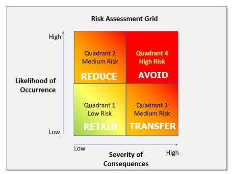
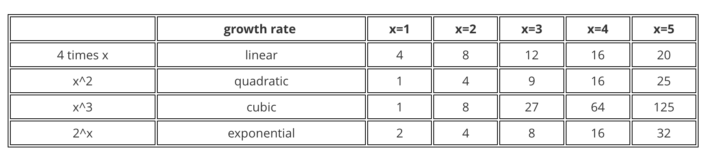

# 6841 Notes

### General Info

Lecturer: Richard Buckland   
Course email: cs6441@cse.unsw.edu.au  
Tutor email: z5367571@ad.unsw.edu.au

- Logbooks - 30%
- Something Awesome Project - 30%
- Exam (take home) - 40%

## Security Engineering
The principles and practice of designing and managing complex systems against adversaries in a world of humans, technology, cryptography and regulation.
- Cyber security refers to when things go wrong, when things go out of the spec.

## Mindset

**DAEH**

**Defender Mindset**: A protective approach centered on preventing attacks or mitigating damage. Focuses on safeguarding assets, anticipating threats, and maintaining stability.

**Attacker Mindset**: A proactive, offensive approach focused on exploiting weaknesses or vulnerabilities. Emphasises initiative and finding ways to overcome defenses.

**Engineering Mindset**: A problem-solving approach focused on designing practical solutions while following standards (set of rules followed by all engineers), constraints, testing, modelling and optimising.

- measurement
- skepticism
- testing
- review
- openness/transparency
- treatment of errors
- standards
- professionalism
- closing the loop.

## Security Theatre
Security theater is the practice of implementing security measures that are considered to **provide the feeling of improved security** while doing **little or nothing** to achieve it.

## Physical Security
Physical security focuses on establishing a solid foundation to safeguard systems from threats such as tampering or counterfeiting.
- very hard to get physical security right

## Phases of an attack
Generally an attack start with recon and planning until a vulnerability is found which can then be exploited. 

### Recon
Beginning of an attack, goal is find out more information about what is being attacked. 
- can be **passive** or **active**

## 0 day attacks
0 days refers to a software security flaw that is **unknown** to the software vendor and has not been patched so it can be exploited by attackers.

## Harvard and Von Neumann Architecture
- Harvard architecture has two physically seperate pieces of mememory (slower but safer)

- Von Neumann architecture was chosen for legacy computers
  - same memory stack for both data and control
  - two memory items in one physical piece.

## Buffer Overflow
A buffer is memory used as temporary location for data in a program. 
- The stack (LIFO) grows from **high addresses** to **low addresses**

**Function call process:**
1. Call sum()
2. Push parameters (values of x and y) to the stack
3. Push return address of sum to the stack
4. Push base pointer (end of parent stack) to the stack
5. Execute sum()

Even if you call a function multiple times (e.g. using 4 lines to draw a square), only one stack frame at a time - only one function is actually called at once

## Risk and Trust

### Security Patterns
- **Anti-pattern (complexity)**: Overly complex systems increase the likelihood of security vulnerabilities 
- **Dual control**: Multiple entities need to work together (all keys turned at same time)
- **Defence in depth**: A multi-layered approach to security, implementing multiple security measures to protect systems in case one layer fails.
- **Weakest Link**: The security of a system is only as strong as its weakest component
- **Single Point of Failure**: A component in a system that, if it fails, would cause the entire system to fail, creating a critical vulnerability.
- **Anti-pattern (Defender Mindset)**: An overly defensive approach that focuses solely on preventing attacks rather than also considering detection and response strategies.

## Analysing Risk (NIST - National Institute of Standards and Technology)

- Low likelihood, low impact - we can mostly ignore these risks
- Low likelihood, high impact - very difficult to predict and assess
- High likelihood, low impact - easier to make predictions about due to history
- High likelihood, high impact - very dangerous

## Type I and Type II Errors
### Type I error (false positive)
This error occurs when a true null hypothesis is incorrectly rejected. 
- Test indicates patient has a disease when they actually do not

### Type II error (false negative)
This error happens when a false null hypothesis is not rejected.
- Test fails to detect the presence of the disease in an infected patient.

## Cryptography
**Cryptography** is the process of hiding or coding information so that only the person a message was intended for can read it. 

**CIA**: Confidentially, Integrity, Authentication
- Usually require secrets

### Steganography
**Steganography** is when you have a message but you conceal the existence of the message itself.
- weave the message into a rug
- blink out the message

**Six design principles for military ciphers:**
1. The system must be practically, if not mathematically, indecipherable.
2. It must not be required to be secret, and it must be able to fall into the hands of the enemy without inconvenience.
3. Key must be communicable and retainable without the help of written notes, and changeable or modifiable at the will of the correspondents.
4. It must be applicable to telegraphic correspondence.
5. Apparatus and documents must be portable, and its usage and function must not require the concourse of several people.
6. The system must be easy to use, requiring neither mental strain nor the knowledge of a long series of rules to observe.

**Security by Obscurity**: Improve security by hiding the details/mechanism of the system (assuming people do not know certain things)
- assuming people do not know the frequency of the phone.
- should never be used as the only method of keeping your system secure

## SQL Injection
SQL Injection is when an attacker can modify the data used in an SQL query such that it is executed as code.  
- Attacks aim to manipulate the input string into commands, to gain unauthorised access.

## Confidentiality

### Information measure
An information measure refers to a quantity that calculates the length of the shortest message needed to transmit information.
- Example: compressing a file by removing redudancy (repeated parts) and unused space

## Growth Rate

### Brute Forcing Passwords
Example:

- Length of password: 3, only upper/lower characters: 52 
- So overall combinations: $52^3 \approx 64^3 = (2^6)^3 = 2^{18}$
- On average you find the password after trying half the combinations so $2^{18} / 2 = 2^{17}$ combinations required to find password

 

- CPU clock speed = 3GHz = $2^{31}$ operations per second
- 4 cores, speed = $2^{31} * 2^2 = 2^{33}$ 
- $32 = 2^{5}$ steps per password attempt, so $2^{33}/2^5 = 2^{28}$ attempts per second.

Time to find password: $2^{17} / 2^{28} = 0.0004$ seconds

General rule: $2^{128}$ combinations = $128$ bits enough to protect against brute force (encryption key length not password length).  

## Codes vs Ciphers
- Codes substitute characters for the components of the original message. 
- Ciphers use algorithms to transform a message into an apparently random string of characters.

### Enigma Machine
The Enigma machine is a cipher device that scrambles the 26 letters of the alphabet.
- One person enters text on the Enigma's keyboard and another person writes down which of the 26 lights above the keyboard illuminated at each key press. 
- Entering ciphertext transforms it back into readable plaintext.

### Digital Encryption Standard (DES)
- Break the message into blocks (e.g. 3 bits), encrypt each block, then put the encrypted blocks together 
- Repeat this encryption technique
- Can still be brute-forced (key is 56 bits) 
  - As hardware advanced, it became easier and easier to crack 
- Cracked through differential analysis

### Advanced Encryption Standard (AES)
- 128 bits (10 rounds) 192 bits (12 rounds) 256 bit (14 rounds)

### Stream Cipher vs Block Cipher
- A stream cipher breaks a plaintext message down into single bits, which then are encrypted individually into ciphertext using key bits.
  - Enigma
- A block cipher breaks down plaintext messages into fixed-size blocks before encrypting them into ciphertext using a key. 
  - DES, AES

## Side Channels
Indirect leakage of information from a related physical source 
- Timing attacks, from analysing low level behaviour (taking longer on particular branches than others)
- Computer fan speed changing to a certain frequency
- Sound coming from typing off keyboard
- Radiation leakage from TVs
- Pentagon pizza orders spike whenever an operation is ongoing. 

## Passwords and Keys
**Password:** A password is used for authentication. It is a piece of information that a user knows and uses to prove their identity to access a system or service.  
- e.g. hello123

**Key:** A key is used for encryption or decryption, or for securely accessing data or systems.
- e.g. 3AD77BB40D7A3660A89ECAF32466EF97

### Human Error
Humans are present at some level in every system and almost every breach is due to human error.

### Social Engineering
The most important tool of a hacker is social engineering. Putting individuals into something called "hot state" where you are not thinking clearly.

- fishing is targeting groups of people
- spear fishing is targetting only individuals

## Hardare Security
Software security assumes trustworthy hardware. 

**Example Risks**
- **Hardware Trojans**: hidden malicious modifications on hardware (similar to software trojan)
- **Reverse Engineering**: Used for piracy (to check whether a product is pirated from you, or to copy someone else’s) 
- **IC/IP Piracy and “Overbuilding”**: Manufactorer steals design and build more of the product than required to sell.
- **Counterfeit/forgery**: Companies copying products, with cheaper parts that seem as though they have same functionality.