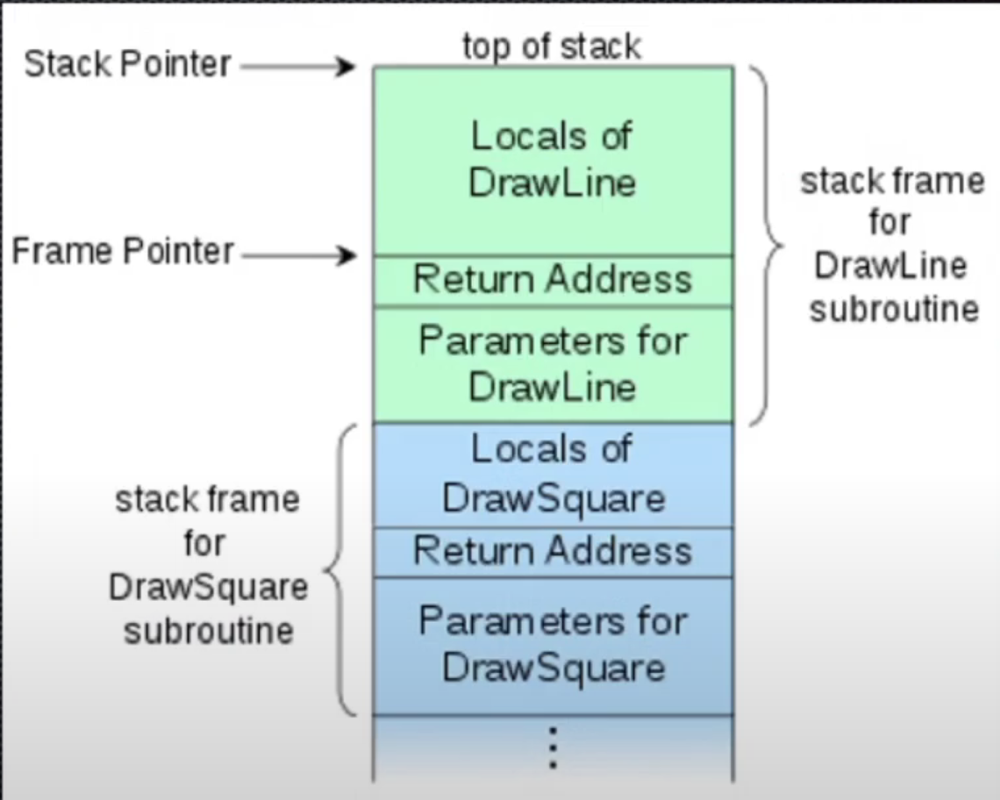

# 6841 Notes

### General Info

Lecturer: Richard Buckland   
Course email: cs6441@cse.unsw.edu.au  
Tutor email: z5367571@ad.unsw.edu.au

- Logbooks - 30%
- Something Awesome Project - 30%
- Exam (take home) - 40%

## Security Engineering
The principles and practice of designing and managing complex systems against adversaries in a world of humans, technology, cryptography and regulation.
- Cyber security refers to when things go wrong, when things go out of the spec.

## Mindset

**DAEH**

**Defender Mindset**: A protective approach centered on preventing attacks or mitigating damage. Focuses on safeguarding assets, anticipating threats, and maintaining stability.

**Attacker Mindset**: A proactive, offensive approach focused on exploiting weaknesses or vulnerabilities. Emphasises initiative and finding ways to overcome defenses.

**Engineering Mindset**: A problem-solving approach focused on designing practical solutions while following standards (set of rules followed by all engineers), constraints, testing, modelling and optimising.

- measurement
- skepticism
- testing
- review
- openness/transparency
- treatment of errors
- standards
- professionalism
- closing the loop.

## Security Theatre
Security theater is the practice of implementing security measures that are considered to **provide the feeling of improved security** while doing **little or nothing** to achieve it.

## Physical Security
Physical security focuses on establishing a solid foundation to safeguard systems from threats such as tampering or counterfeiting.
- very hard to get physical security right

## Phases of an attack
Generally an attack start with recon and planning until a vulnerability is found which can then be exploited. 

### Recon
Beginning of an attack, goal is find out more information about what is being attacked. 
- can be **passive** or **active**

## 0 day attacks
0 days refers to a software security flaw that is **unknown** to the software vendor and has not been patched so it can be exploited by attackers.

## Harvard and Von Neumann Architecture
- Harvard architecture has two physically seperate pieces of mememory (slower but safer)

- Von Neumann architecture was chosen for legacy computers
  - same memory stack for both data and control
  - two memory items in one physical piece.

## Buffer Overflow
https://eli.thegreenplace.net/2011/02/04/where-the-top-of-the-stack-is-on-x86/

A buffer is memory used as temporary location for data in a program. 
- The stack (LIFO) grows from **high addresses** to **low addresses**

**Function call process:**
1. Call sum()
2. Push parameters (values of x and y) to the stack
3. Push return address of sum to the stack
4. Push base pointer (end of parent stack) to the stack
5. Execute sum()

Even if you call a function multiple times (e.g. using 4 lines to draw a square), only one stack frame at a time - only one function is actually called at once

## Risk and Trust

### Security Patterns
- **Anti-pattern (complexity)**: Overly complex systems increase the likelihood of security vulnerabilities 
- **Dual control**: Multiple entities need to work together (all keys turned at same time)
- **Defence in depth**: A multi-layered approach to security, implementing multiple security measures to protect systems in case one layer fails.
- **Weakest Link**: The security of a system is only as strong as its weakest component
- **Single Point of Failure**: A component in a system that, if it fails, would cause the entire system to fail, creating a critical vulnerability.
- **Anti-pattern (Defender Mindset)**: An overly defensive approach that focuses solely on preventing attacks rather than also considering detection and response strategies.

## Analysing Risk (NIST - National Institute of Standards and Technology)

- Low likelihood, low impact - we can mostly ignore these risks
- Low likelihood, high impact - very difficult to predict and assess
- High likelihood, low impact - easier to make predictions about due to history
- High likelihood, high impact - very dangerous

## Type I and Type II Errors
### Type I error (false positive)
This error occurs when a true null hypothesis is incorrectly rejected. 
- Test indicates patient has a disease when they actually do not

### Type II error (false negative)
This error happens when a false null hypothesis is not rejected.
- Test fails to detect the presence of the disease in an infected patient.

## Cryptography
**Cryptography** is the process of hiding or coding information so that only the person a message was intended for can read it. 

**CIA**: Confidentially, Integrity, Authentication
- Usually require secrets

### Steganography
**Steganography** is when you have a message but you conceal the existence of the message itself.
- weave the message into a rug
- blink out the message

**Six design principles for military ciphers:**
1. The system must be practically, if not mathematically, indecipherable.
2. It must not be required to be secret, and it must be able to fall into the hands of the enemy without inconvenience.
3. Key must be communicable and retainable without the help of written notes, and changeable or modifiable at the will of the correspondents.
4. It must be applicable to telegraphic correspondence.
5. Apparatus and documents must be portable, and its usage and function must not require the concourse of several people.
6. The system must be easy to use, requiring neither mental strain nor the knowledge of a long series of rules to observe.

**Security by Obscurity**: Improve security by hiding the details/mechanism of the system (assuming people do not know certain things)
- assuming people do not know the frequency of the phone.
- should never be used as the only method of keeping your system secure

## SQL Injection
SQL Injection is when an attacker can modify the data used in an SQL query such that it is executed as code.  
- Attacks aim to manipulate the input string into commands, to gain unauthorised access.

## Confidentiality

### Information measure
An information measure refers to a quantity that calculates the length of the shortest message needed to transmit information.
- Example: compressing a file by removing redudancy (repeated parts) and unused space

## Growth Rate

### Brute Forcing Passwords
Example:

- Length of password: 3, only upper/lower characters: 52 
- So overall combinations: $52^3 \approx 64^3 = (2^6)^3 = 2^{18}$
- On average you find the password after trying half the combinations so $2^{18} / 2 = 2^{17}$ combinations required to find password

 

- CPU clock speed = 3GHz = $2^{31}$ operations per second
- 4 cores, speed = $2^{31} * 2^2 = 2^{33}$ 
- $32 = 2^{5}$ steps per password attempt, so $2^{33}/2^5 = 2^{28}$ attempts per second.

Time to find password: $2^{17} / 2^{28} = 0.0004$ seconds

General rule: $2^{128}$ combinations = $128$ bits enough to protect against brute force (encryption key length not password length).  

## Codes vs Ciphers
- Codes substitute characters for the components of the original message. 
- Ciphers use algorithms to transform a message into an apparently random string of characters.

### Enigma Machine
The Enigma machine is a cipher device that scrambles the 26 letters of the alphabet.
- One person enters text on the Enigma's keyboard and another person writes down which of the 26 lights above the keyboard illuminated at each key press. 
- Entering ciphertext transforms it back into readable plaintext.

### Digital Encryption Standard (DES)
- Break the message into blocks (e.g. 3 bits), encrypt each block, then put the encrypted blocks together 
- Repeat this encryption technique
- Can still be brute-forced (key is 56 bits) 
  - As hardware advanced, it became easier and easier to crack 
- Cracked through differential analysis

### Advanced Encryption Standard (AES)
- 128 bits (10 rounds) 192 bits (12 rounds) 256 bit (14 rounds)

### Stream Cipher vs Block Cipher
- A stream cipher breaks a plaintext message down into single bits, which then are encrypted individually into ciphertext using key bits.
  - Enigma
- A block cipher breaks down plaintext messages into fixed-size blocks before encrypting them into ciphertext using a key. 
  - DES, AES

## Side Channels
Indirect leakage of information from a related physical source 
- Timing attacks, from analysing low level behaviour (taking longer on particular branches than others)
- Computer fan speed changing to a certain frequency
- Sound coming from typing off keyboard
- Radiation leakage from TVs
- Pentagon pizza orders spike whenever an operation is ongoing. 

## Passwords and Keys
**Password:** A password is used for authentication. It is a piece of information that a user knows and uses to prove their identity to access a system or service.  
- e.g. hello123

**Key:** A key is used for encryption or decryption, or for securely accessing data or systems.
- e.g. 3AD77BB40D7A3660A89ECAF32466EF97

### Human Error
Humans are present at some level in every system and almost every breach is due to human error.

### Social Engineering
The most important tool of a hacker is social engineering. Putting individuals into something called "hot state" where you are not thinking clearly.

- fishing is targeting groups of people
- spear fishing is targetting only individuals

## Hardware Security
Software security assumes trustworthy hardware. 

**Example Risks**
- **Hardware Trojans**: hidden malicious modifications on hardware (similar to software trojan)
- **Reverse Engineering**: Used for piracy (to check whether a product is pirated from you, or to copy someone else’s) 
- **IC/IP Piracy and “Overbuilding”**: Manufactorer steals design and build more of the product than required to sell.
- **Counterfeit/forgery**: Companies copying products, with cheaper parts that seem as though they have same functionality.

## Supply Chains
A supply chain attack is a cyberattack where hackers target vulnerabilities in an organisation's external suppliers or vendors to infiltrate its systems.

## Risk Revision  
**Examples**
- OceanGate submarine implosion: low probability high impact risks were ignored due to previous successful missions.  
- Trust exchange: giving the government sensitive data so companies doesnt need to hold sensitive data (government can be compromised).

 

- The hardest part about risks is spotting the risk, it is invisible and very hard to see. 
- What are the risks? (you need to find them all the risks)
- Risks are not always independent.  

Follow a well established framework to analyse risk. (attack trees)

### How do we measure risks
A risk has a distribution, normally it is a normal distribution however some risks are **fat-tail risks** which are more skewed. 
- Fat-tails risks are hard to deal with
- Example: closure of bankestown line, you can't be sure when it will be done.

### How do risks interact
- Some risks are not independent and some risk are independent, think about correlations between risks.
- Example: bushfires $\rightarrow$ cell towers down $\rightarrow$ no communication.

## Bits
- 10 digit number: $10^{10} \approx (2^3)^{10} = 2^{30}$, 30 bits
- 3 digit number: $10^{3} \approx (2^3)^{3} = 2^{9} \approx$, 10 bits

For $8000,000,000 = 2^3 * 2^{10} * 2^{10} * 2^{10} = 2^{33}$

## Confidentiality
### Key Problem
Huge amount of keys to talk to a lot of people confidentially.
- $\frac{n^2}{2}$ keys required to talk to $n$ people.

## Asymmetric Ciphers
**Merkle Puzzle**: Imagine A and B wish to communicate securely. A creates 1000 puzzles sends all of them to B. Each puzzle is encrypted, and the content involves a **message number and a password**. Once B solves **one** puzzle, he sends the message number to A via plain text (anyone can see, does not matter). So, if anyone else manages to read this message number, it is still safe since they do not know which puzzle it was and which password is related to it. 

**Symmetric Ciphers**: Same key is used to encrypt and decrypt

**Asymmetric Ciphers**: Two different keys used to encrypt and decrypt
- Public encrypt key is shared and private decrypt key is secret.
- Works using math functions.
 
## Man in the middle attacks
A Man-in-the-Middle (MITM) attack is when an attacker secretly intercepts and alters communication between two parties.

## Terminology 

### Tranquility
Tranquility refers to the assumption that a system remains in a stable, secure state throughout its operation without change. Roles never change
- assuming a student can never become a lecturer

### Defence in depth
Defense in depth is a security strategy that involves layering multiple protective measures across different areas of a system or network to reduce the likelihood of a successful attack.
- Swiss cheese model

### Password Recovery
Use a different email than what is used for work, etc. so that compromised main email does not risk the attacker trying to password reset/recover everything attached to that email.

## Social engineering
**Timing:** Attackers will always attack you when it is least convinient to you, least able to defend, least able to notice.
- Attacking during peak period of traffic (more invisible)

**Challenge for attackers**
- get someone to click on a link
- get someone to open an attachment

## Dating scams
- Attacking people’s emotions/vulnerability 
- Shame attachment, people do not report it 

## Human Weakness

### Cognitive Bias
Mental shortcuts or systematic errors in judgment that can affect decision-making related to security practices and risk assessment

### Corruption and self-interest
Beneficial to certain individuals, detrimental to others.
- Sometimes you can't see the corruption and self-interest because it is beneficial to some people (bartender calling police to pub, rest of city does not have police).

## Firewalls
A firewall is a computer network security system that restricts internet traffic in to, out of, or within a private network.

- Attackers will always attack the weakest part of the firewall.

## Insiders

### Whistleblowers
Whistleblowers are individuals who expose illegal, unethical, or harmful activities within an organisation to authorities or the public.

## XSS (cross site scripting)
Original name is **cross site scripting** because you are able to invoke a **script** from another website. These days it includes scripts that are **injected directly into page** for client to render.
- allows attackers to run code on client's web browser as it were part of the page itself.

### XSS Stored (P1)
- Attacker stores malicious code into database through web application. Code is then executed on victim's browser (blog post or bomment)
  
1. Attacker stores malicious data into a webserver database 
2. User requests data (like normal) 
3. Database sends malicious data 
4. Malicious data runs on user's site 

### XSS Reflection (P1/P2)
- Parameter sent from user is reflected back onto the page.

1. Attacker sends malicious link to user 
2. User clicks bad link, and it gets run in the browser 
3. Browser sends stolen data back to attacker 
   
A very common attack, mostly done via phishing. Often done to steal sessions via cookies. 

### XSS Self
- Type of reflected XSS that can only affect yourself. 
- Not super useful but can mean proper framework/ procedure is not being followed. There may be a vulnerability somewhere else on the application. 

## Authentication 
Authentication has to do with humans whereas confidentiality and integrity refer to the data.
- Challenge of authentication: connect physical and digital world for authentication (computer making decisiion does not know anything about outside world)

## Privacy
Privacy and security are highly related issues. 

- Government – want your data for honourable and good services 
- Companies – want to sell you stuff/make money 
- You – want your privacy 

Privacy can lead to being compromised 
- Personal information is often used to answer security questions. 

## Format Strings (todo)

## Integrity
Data integrity is the assurance that digital information is uncorrupted and can only be accesed or modifited by those authorised to do so.

### Blockchains
- Not inherently integral since attacks can still occur on blockchains 

## The Luhn Algorithm
- Credit card numbers are generated algorithmically. 
- Every bank has a unique set of starting numbers.  
- Bank then generates the **rest of the 15 numbers**, final digit is generated via the **Luhn Algorithm**. 

## Checksum
A way of validating something by storing data into the data its**e**lf, useful for checking data intergrity.
- Powerful but not all knowing (you can detect an error has occured but not what error)

## Types of Hashes
A hash is anything that takes in a variable amount of data and converts it into **deterministically** generated output of data of fixed length.

### Cryptographic hashes
- Need to be resistant to certain types of attacks 
- Slow by design 
- Examples: MD5, SHA1/2/3 
- Try to minimise which keys get mapped to the same value

### Non-crptographic
- Need to be fast and not necessarily unique every time 
- Example: Creating a hash table in python. If a value is already taken in the table, just use the next cell.

## Attacks on Hashing - Pre-image attacks
Given a hash find the plaintext that hashes to the hash

- Dictionary attack makes it more likely to find a hit
- On average you have to are to find specific instance of 128 bit has after 2^127 tries (half way).

### Brute Force
Brute force – go through a whole bunch of common passwords and check if the hashes match.

## Attacks on Hashing - Second Pre-image attacks
Given plaintext and its hash find another plain text with same hash.

- On average 2^127 tries (half way) to randomly compute a plain text that matches a specific instance of a 128 bit hash AND is not the same as the original text is.

## Attacks on Hashing - Collision attacks or Birthday Attacks
Given the hash algorithm find two plaintext that have the same hash. 
-  On average 2^64 hashes must be tried to find a collision. 

## Attacking Summary

### Week 10 movie: Dr StrangeLove (1 Exam question on it)

## Cryptographic hash function

Suppose **hash(m)** is some cryptographic hash function 

**Pre-image resistance** given the hash **h**, it is computationally infeasible to find the input **m_1** such that **hash(m_1) = h**.

**Second pre-image resistance**: given a message **m_1** it is computationally infeasible to find a second distinct message** m_2** such that **hash(m_1) = hash(m_2)**

**Collision resistance**: computationally infeasible to find **hash(m_1) = hash(m_2)** where **m_1** is distinct to **m_2**.

Given those properties we can use cryptographic hash functions as building blocks (primitives) for more complex systems. 

### Birthday Game
How many people required for a 50% change that 2 people have the same birthday. 

**Answer: 23 people** $\frac{23 * 22}{2} = 253, \frac{253}{365} = 50$%

Approximately $\sqrt(n)$ tries. 

If you have plain-text that is 128-bit and also a slightly ultered version that is also 128-bit hashed. It takes approx 2^64 little changes before you get the same plain-text value.

## Common Hashes
The most common hash right now is SHA2. There are still weaknesses, but SHA2 is better than MD5. 

## Hashing long messages
###  Electronic Code Book (ECB) 
Break message into chunks, encrypt each chunk and concatenate each chunk together.  

### Cipher Block Chaining (CBC)
Take the message and break into chunks (P[0], P[1], P[2]). 

### Counter (CTR)
Break down message into chunks, then take a nonce (number you use once) and a counter and encrypt them together. After XOR the current chunk with the encrypted nonce to get the ciphertext. 

## Message Authentication Code (MAC)
Imagine you have a message and append some **private** to the end and then hash the message. The hashed message is called a **MAC = Hash (message || secret_key)**.

### Length extension attacks
MACs are vulnerable to **length extension** attacks, where the attacker can use **Hash(message1)** and the length of **message1** to calculate **Hash(message1 || bad_message)** for an attacker-controlled **bad_message**, without needing to know the content of message1. 

They are able to alter the message without knowing the **secret_key**.

- Modern day we use a H-MAC.  

## Safety - V Model of the Systems Development Lifecycle

Engineering principles on the left (safer), testing risker on the right. All that is being tested is the machine is following the **right processes** with the right level of quality.

### Fuzzing testing 
Fuzz testing or fuzzing is an automated software testing method that injects invalid, malformed, or unexpected inputs into a system to reveal software defects and vulnerabilities.

## GEMS (Generic Error Modelling System) and Errors

Errors can occur at each level of performance:

Skill-based (SB): slips and lapses
- usually errors of inattention or misplaced attention
  
Rule-based (RB): mistakes
- usually a result of picking an inappropriate rule
- caused by misconstrued view of state, over-zealous pattern matching, frequency gambling, deficient rules
  
Knowledge-based (KB): mistakes
- due to incomplete/inaccurate understanding of system, confirmation bias, overconfidence, availability heuristic (kahneman), cognitive strain.

Humans are reluctant to move from a RB to KB level even if rules aren’t working. 

## ShatGPT

### Amazon S3
Amazon Simple Storage Service (Amazon S3) is an object storage service that is used to share static assets (effective web file share essentially).

### Serverless compute and Lambda Functions
Serverless computes means you do not need a server, virtual server, laptop. You do not need to maintain, patch, secure it.

In this case the Lambda function is a very stripped down python docker container that is created every time a user makes a request.

**How did they trick openai to give the keys though to bypass SQLi?**

User sends input to the AWS Cloud via Chat Web App (Vue) which then sends the input to the AWS API Gateway + Lamda, the Lamda function then sends the input to the OpenAI for it to be summarised. The summarized input is then sent back to the Lambda function, Lamda function then asks the database for results and the results is sent back to the AWS Cloud and it sends back to the user. 

When user asks OpenAI, user asks for SQLi injection to be in the payload. 

## WAF rules
Web Application Firewalls that you put in place to allow, block and monitor web requests based on them satisfying certain conditions.
- Can be a default; good at detecting generic attacks 

## TLS, SSL, HTTPS
In the old days, emails and information sent across the web was open for everybody to see 

- Not confidential 
- None or limited encryption 
- Had to assume no one else was sniffing 
- One solution: Encrypt emails before sending and decrypt upon receiving 

## One-time-pad
Explanation: https://www.youtube.com/watch?v=QVV_bUxxiZ8

Given a plain text of length x, convert it to binary (A). Use a RNG to generate x numbers, binary (B, this is the pad). XOR A and B to get encrypted text (C)  of length x. A receiver get C and can decrypt by XOR C and B to get A.

## Man in the Middle Attack (RSA public private key)

**Expection**: User A wants to communicate with user B, so they search up B's public key, encrypt their message with it, then send it to user B. B can then decrypt the message with their private key. 

**MITM Attack**: When A searches for B's public key, user C puts their public key there instead. So A encrypts the message with C's public key and sends it off. User C intercepts the message and decrypts it, with their private key (now have access to message). User C then encrypts the message with B's public key and sends it off to B. 

- In both cases user A and C get the exact same message (no way to tell it was intercepted)

## Public key infrastructure (PKI) 
Company A has a public and private key. 
- A sends the key and relevant docs to a certificate authority (CA, a trusted register that certifies public keys are valid and actually from company A). 
- The CA signs the key (hashes it) so and puts it on the internet (called a certificate). 
- Anyone online can get the certificate and see that it was signed by a CA. 

Browsers contain the preinstalled repository of public key of CA's, so to check if certificate signature is valid, they check this list.